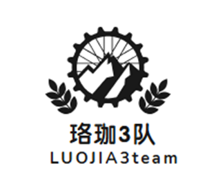

# 团队介绍：

## 一、团队说明

__团队名称：__
珞珈3队

__中文寓意：__
队名谐音珞珈山，象征着队员的出身，在接下来的3年时光里向着目标不断前进。

__团队宣言：__
珞珈山下一段青春，debug路上一生奋斗

__团队Logo：__
	

__Logo寓意说明：__
齿轮代表着团队协作，山脉意味着坚韧不拔和克服困难的精神，麦穗意味着最后的成功。

## __二、团队结构：__

__1、团队模式：__
Scrum团队

__2、成员组成和说明__

| 姓名  | 角色      | 联系方式        | 特点说明                   |
|-----|----------|-------------|------------------------|
| 陶恒轩 | Master  | 1**** | 交际能力强，规划能力较强           |
| 何思成 | 技术主管    | 1**** | 学习能力强，不畏难，善于解决难题，技术水平高 |
| 申一帆 | Team 成员 | 1**** | 思维拓展能力强，想的全面，动手能力强     |
| 常怡然 | PO      | 1**** | 幽默风趣，交际能力强，执行力高        |
| 刘家明 | Team 成员 | 1**** | 交际较弱，动手较强，能够较为良好完成任务   |

## __三、项目说明__

### 1、项目类型：

  命题项目

### 2、项目名称：

  珞珈云-云端文件同步工具

### 3、技术平台：

  前端：C++/Qt；

  后端：Python/Flask；mysql数据库

### 4、方向类型：

应用

### 5、项目简介：

本项目是一个轻量级的文件同步工具，实现本地文件夹与云端的双向同步，支持文件版本控制，提升数据备份与共享便捷性。

#### 详细需求：
1. 账户管理。
2. 文件夹选择与同步策略设定 。
3. 文件上传/下载，断点续传。
4. 版本控制与历史记录查看。
5. 同步状态监控。

#### 涉及技术:
- C++网络通信
- 文件操作与同步算法
- 云存储API(如AWS S3)

#### 技术细节:

__C++/Qt 逻辑层:__
- 通过AWS SDK实现上传/下载过程，监听文件变化，新增/修改同步文件夹(单向、双向),处理用户登录逻辑,版本控制和历史记录(基于ETag)

[项目地址](https://github.com/LawPlusThree/QSyncUi)

__Python后端:__
- 1. 基于`mysql`数据库和`Flask`实现用户注册、登录、找回密码、设备管理;
- 2. 根据用户分配S3存储库临时Token
- 3. 使用Docker进行一键部署
[项目地址](https://github.com/Alexander-Porter/qSyncBackend)

**2024年7月1日 星期一**
